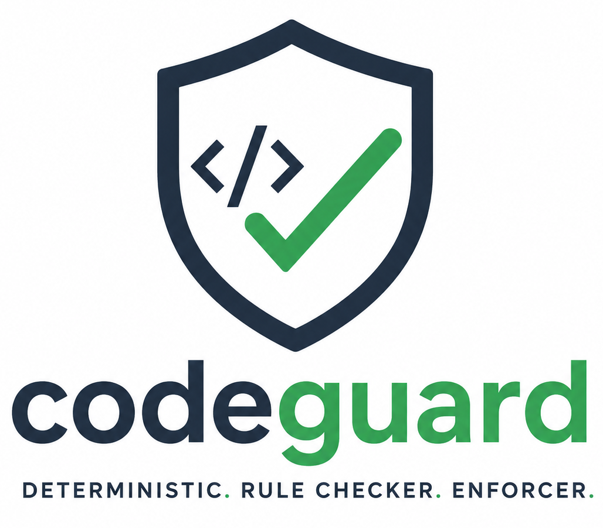

<p align="center">
  
</p>

<h1 align="center">CodeGuard</h1>
<p align="center"><em>Deterministic, machine-checkable engineering rules for .NET repositories.</em></p>

<p align="center">
  <a href="https://github.com/james-d12/CodeGuard/actions/workflows/ci.yml"></a>
  <a href="https://www.nuget.org/packages/CodeGuard"></a>
  <a href="LICENSE"></a>
</p>

CodeGuard checks a .NET repository against an organisation's engineering standards (DDD,
architecture layering, C# conventions, and more) and reports structured violations. Rules are
written as declarative YAML, not C# code, so new standards can be added without touching the
engine itself. It's meant to sit alongside AI coding agents as a guardrail: agents load the
rules that apply before generating code, then CodeGuard validates what they produced and flags
anything that breaks the rules.

## Requirements

- .NET SDK `10.0.100` or later (pinned in `global.json`, `rollForward: latestFeature`)

## Build & test

```bash
dotnet build
dotnet test
```

## Installation

The CLI is published to nuget.org as a [.NET tool](https://learn.microsoft.com/en-us/dotnet/core/tools/global-tools):

```bash
dotnet tool install -g CodeGuard
codeguard --help
```

This installs the `codeguard` command globally. Every example in [CLI usage](#cli-usage) below
works the same whether you run it as `codeguard <command>` after installing, or as
`dotnet run --project src/CodeGuard.Cli -- <command>` from a checkout of this repo.

## CLI usage

If you've installed the tool, run commands directly as `codeguard <command>`. From a checkout of
this repo, use `dotnet run --project src/CodeGuard.Cli -- <command>` instead.

| Command | Description |
|---|---|
| `validate` | Validate a repository against configured rules |
| `rules list` | List rules discovered from the configured rule directories |
| `rules explain <ruleId>` | Print full metadata and source YAML for a single rule |
| `rules validate` | Validate a set of rule YAML files for structural correctness (not run against a repository) |
| `rules test` | Run rules' embedded `tests:` cases against a virtual analysis model (no repository, no disk I/O) |
| `rules create` | Interactively scaffold a new rule YAML file |
| `setup` | Configure the rules source (a directory or git repo) used across all repos |
| `info` | Show where rules are configured from and how many were discovered |

Shared by most commands:

| Option | Meaning |
|---|---|
| `--path` | Repo root (default: current directory) |
| `--config` | An explicit `.codeguard/config.yml` |
| `--rules-source` | Point straight at a rules directory or git URL, bypassing config (see below) |
| `--branch` | Git branch to use with `--rules-source` |

Command-specific options:

| Command | Options |
|---|---|
| `validate` | `--format console\|json\|sarif\|html`, `--output <file>`, `--rule <id>` (repeatable), `--solution <file>` (repeatable), `--severity-threshold`, `--fail-on`, `--color` / `--no-color`, `--max-parallelism` |
| `rules list` | `--format table\|json`, `--tag`, `--enabled-only` |
| `rules validate` | `--format console\|json` |
| `rules test` | `--format console\|json`, `--rule <id>` (repeatable) |
| `setup` | `--source`, `--branch`, `--type directory\|git` (see below) |

Examples (installed tool):

```bash
codeguard rules list
codeguard rules explain DDD-ENTITY-001
codeguard rules create
codeguard validate --format json --output report.json
```

Examples (from a checkout of this repo):

```bash
dotnet run --project src/CodeGuard.Cli -- rules list
dotnet run --project src/CodeGuard.Cli -- rules explain DDD-ENTITY-001
dotnet run --project src/CodeGuard.Cli -- validate --format json --output report.json
```

### Configuring where rules come from

By default, `validate`/`rules list`/etc. look for rules via `.codeguard/config.yml` in the
target repo. There are two ways to point them somewhere else.

**One-time setup**, so every command works out of the box against any repo without per-repo
configuration. This is stored outside any repo, in the OS user/app-data directory:

```bash
# interactive - prompts for a directory path or git URL (and a branch, for git)
dotnet run --project src/CodeGuard.Cli -- setup

# non-interactive, a local directory of rules
dotnet run --project src/CodeGuard.Cli -- setup --source /home/jamie/rules-checkout

# non-interactive, a git repo - clones on first run, fetches/fast-forwards on later runs
dotnet run --project src/CodeGuard.Cli -- setup --source https://github.com/org/rules-repo.git --branch main
```

`setup` is the only thing that ever syncs a git rule source; `validate` and friends never fetch
on their own, so results stay reproducible between runs. Re-run `setup` whenever you want the
latest rules. Run `codeguard info` any time to check which source is active and how many rules
it resolved.

**Ad-hoc, one-off override**: skip `setup` entirely and point a single command straight at a
rules directory or git URL, without persisting anything.

```bash
dotnet run --project src/CodeGuard.Cli -- validate --path . --rules-source ../local-rules-checkout
dotnet run --project src/CodeGuard.Cli -- validate --path . --rules-source https://github.com/org/rules-repo.git --branch main
```

Resolution precedence, highest first: `--rules-source`, then `--config`, then the target repo's
own `.codeguard/config.yml`, then a prior `setup` run's global settings, then the built-in
default. See `docs/done/SETUP_COMMAND_PLAN.md` for the full design.

> **Known limitation:** running `validate` against this repo's own solution (`CodeGuard.sln`)
> still doesn't complete end-to-end. It gets much further than it used to, but crashes in
> `NoPureDelegationOverrideAnalyzer` on a `FullName` collision between identically-named
> auto-generated stub types across test projects. Other repos aren't affected. See `CLAUDE.md`
> and `docs/IMPLEMENTATION_STATUS.md` for details.

## Anatomy of a rule

A rule is plain YAML: a `target` selector that picks out the code elements to check, plus one or
more `assertions` that every match has to satisfy. Here's one of the sample rules in
`examples/rules/ddd/ddd-entity-001.yml`:

```yaml
id: DDD-ENTITY-001
name: Domain entities must inherit from Entity
description: >
  All domain entities must inherit from the approved Entity<TId> base class.
severity: error
enforcement:
  classification: deterministic
tags:
  - ddd
  - domain
  - entity
remediation: >
  Inherit from Contoso.Domain.Entity<TId>.
illustrative: true

target:
  kind: class
  namespace: "Contoso.Domain.Entities"

assertions:
  - must_inherit_from:
      type: "Contoso.Domain.Entity<*>"
```

(`illustrative: true` just marks this as one of the repo's own sample rules rather than a real
policy; it's not part of the schema you need for your own rules.)

`validate` loads every rule from the configured rules directory, runs its `target` selector
against the repository's analysis model (types, projects, namespaces, and so on) to find
matching code, then checks each `assertion` against every match. A failing assertion becomes a
violation reported at the rule's `severity`, with its `remediation` text attached, in whichever
`--format` you asked for.

Run `codeguard rules explain <ruleId>` to see a rule's full metadata and source YAML, or
`codeguard rules create` to scaffold a new one interactively. The JSON Schema every rule is
validated against lives at `examples/rules/schema/rule.schema.json`.

More sample rules, including a larger set of realistic, non-illustrative ones, live under
`examples/rules/`. Browse there for a fuller picture of what a rule set looks like before writing
your own.

## Configuration

`.codeguard/config.yml` tells CodeGuard where to discover rules, skills, agents, source, and
tests in a given repository; missing paths are skipped silently. Rule files are just YAML
validated against `rules/schema/rule.schema.json`'s shape (see `examples/rules/` for samples).

## Project layout

- `CodeGuard.Analysis`: pure model + analysis provider abstraction (no dependencies)
- `CodeGuard.RuleModel`: selector/assertion/condition interfaces
- `CodeGuard.Evaluation` / `CodeGuard.Core`: concrete selectors/assertions, and the rule evaluator
- `CodeGuard.Analyzers.Roslyn` / `.MSBuild` / `.Repository`: data providers (Roslyn, MSBuild via `MSBuildWorkspace`, filesystem)
- `CodeGuard.Reporting`: Console/Json/Sarif/Html violation reporters
- `CodeGuard.Configuration`: YAML rule parsing
- `CodeGuard.Cli`: the `codeguard` command-line tool, depends on everything above

## Further reading

- `docs/PRIMITIVES.md`: original design rationale
- `docs/done/SETUP_COMMAND_PLAN.md`: design of the `setup` command and rule-source resolution
- `CLAUDE.md`: contributor/agent guidance, architecture detail, and known gotchas
